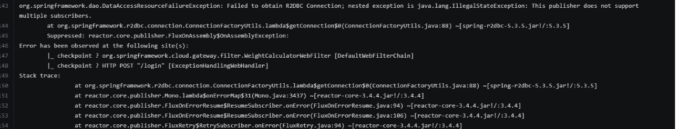

# Spring Gateway with R2DBC Oracle

The object of this project is testing a reactive solution with R2DBC Oracle library and spring gateway 

## Requirements

- Liquibase
- Spring boot starter data r2dbc
- Spring boot starter webflux
- Reactor project
- Oracle r2dbc v0.1.0

## Test in dev mode

1. Configure db Oracle connection in application.yml
2. Enable tags in db.changelog-master.yaml

### End point

Endpoint                      | Method | Auth? | Description
----------------------------- | ------ | ----- | -----------
`/token`                    | POST   | No   |  Validate request http with filter

 
## Problems found (without solution)

When the load of requests increase the oracle r2dbc library report, not availables threads:

ERROR 1 --- [or-http-epoll-3] a.w.r.e.AbstractErrorWebExceptionHandler : [e6fb1493-1]  500 Server Error for HTTP POST "/token" 
org.springframework.dao.DataAccessResourceFailureException: Failed to obtain R2DBC Connection; nested exception is java.lang.IllegalStateException: This publisher does not support multiple subscribers. 

 